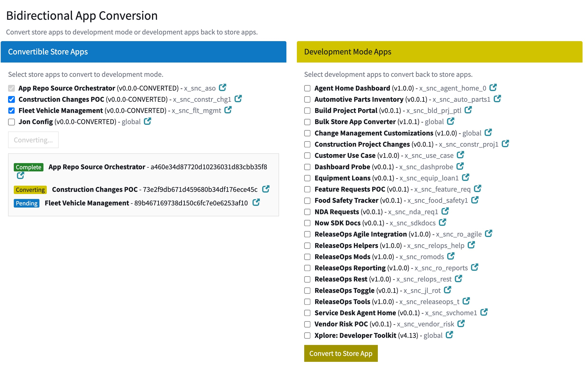

# Bulk Store App Upgrader and Converter

A global-scope ServiceNow utility for administrators to bulk-upgrade Application Repo store apps and then bulk-convert them between store mode (`sys_store_app`) and development mode (`sys_app`).

See a demo and more information on ServiceNow Community at https://sn.works/aemc/bulkupgradeconvert

## Bulk Upgrade Feature

The upgrade script automatically retrieves and installs the latest versions of your Application Repo store apps on a cloned instance. This is configured via the `bulk_convert_store_app.convertible_apps` system property, which contains a comma-separated list of app scope names (e.g., `x_myapp_1,x_myapp_2`) that should be auto-upgraded.

Run **System Applications > Bulk Upgrade My Company Apps** which will check for new versions and install the latest version. This ensures cloned instances have any versions which may have been stashed as part of the clone process but not deployed to prod yet.

**Prerequisite**: Configure the `bulk_convert_store_app.convertible_apps` property in production with the list of scopes you want to auto-upgrade on every clone.

## Bulk Convert Feature

This app provides a single UI page with two side-by-side panels for bidirectional app conversion:

- **Left Panel — "Convertible Store Apps"**: Lists store applications eligible to be converted to development mode. Uses `sn_app_api.AppStoreAPI.canConvertSysStoreApp()` as the eligibility filter.  

- **Right Panel — "Development Mode Apps"**: Lists custom-scoped development applications eligible to be converted back to store/repo mode. Uses `sn_app_api.AppStoreAPI.canConvertSysApp()` as the eligibility filter.

> Missing apps in the left hand panel? Make sure that `sn_appauthor.all_company_keys` system property has your company app key, e.g. for `x_snc` it is `snc`. Contact support to fix this if any keys are missing or use a script like this one https://www.servicenow.com/community/servicenow-ide-sdk-and-fluent/now-sdk-amp-cli-sn-appauthor-all-company-keys-issue-resolution/m-p/3525707

The convert UI handles bidirectional app mode conversion: store apps can be converted to development mode for customization, and development apps can be converted back to store/repo mode for distribution. The interface uses client-side Ajax (`com.snc.apps.AppsAjaxProcessor`) because the underlying conversion APIs aren't directly callable from the server—the client-side approach was the only reliable way to drive bulk conversions.

The page polls `sys_execution_tracker` every 3 seconds to track completion of each conversion in the batch, providing real-time status updates (`Pending` → `Converting` → `Complete`/`Failed`). After all conversions finish, users refresh to see the updated lists as apps move between the left and right panels.

## How to use it
For the conversion UI specifically, ensure your application scope is set to **Global** (required for conversion operations). Select apps in either panel and click **Convert to Dev Mode** (left) or **Convert to Store App** (right). The interface tracks progress in real-time, and after refresh, apps will appear in their new panel.

1. Navigate to **System Applications > Bulk Convert Store Apps** in the application navigator.
2. Ensure your application scope is set to **Global** (required for conversion operations).
3. Check the apps you want to convert in either panel.
4. Click **Convert to Dev Mode** (left) or **Convert to Store App** (right).
5. Watch the inline status progress: `Pending` → `Converting` → `Complete`/`Failed`.
6. After all conversions finish, refresh the page to see the updated lists (apps will move between panels).

### How Conversion Works

Conversions are initiated via GlideAjax calling `com.snc.apps.AppsAjaxProcessor` with:

- `sysparm_function: 'convertToDevelopmentApp'` (store → dev)
- `sysparm_function: 'convertToStoreApp'` (dev → store)

Each conversion starts a background progress worker. The page polls `sys_execution_tracker` every 3 seconds until the job completes before starting the next conversion in the batch.

### Server-Side Logic

The page queries `sys_scope` (parent table of both `sys_store_app` and `sys_app`) sorted alphabetically by name. For each record, it checks `sys_class_name` and calls the appropriate API:

- `sys_store_app` + `canConvertSysStoreApp() = true` → left panel
- `sys_app` + `canConvertSysApp() = true` → right panel

## Requirements

- **Role**: `admin`
- **Scope**: Must be in Global scope to perform conversions
- **Platform**: ServiceNow (Washington DC+)

## New Post-Clone Workflow

1. Clone the instance
2. Log into the cloned dev instance
3. Navigate to **System Applications → Bulk Upgrade My Company Apps** and run the upgrade script to pull the latest app versions for apps listed in `bulk_convert_store_app.convertible_apps`
4. Ensure your application scope is set to **Global** (required for conversion operations).
5. Navigate to **System Applications → Bulk Convert My Company Apps** to restore development mode by selecting your apps and clicking **Convert**

## Bundling / Export

- **Fork**: Feel free to fork this repo and install it into your instance directly.
- **Copy Pasta**: There are two main files, the script include and the UI Page and a couple of modules.  You may wish to just manually create your own files and copy paste the code.

## Contributions

If you fork it, they will come. Please reach out to request to be a contributor if you are planning to make changes to this code. I would love to see what you're doing and learn from you.

## Use this as inspiration

This is meant to be inspiration for you to build your own solution. There is no warranty and teh expectation is that you can support this yourself.  If you have an issue please feel free to become a contributor and submit the solution and/or create an issue.  

Happy coding!
